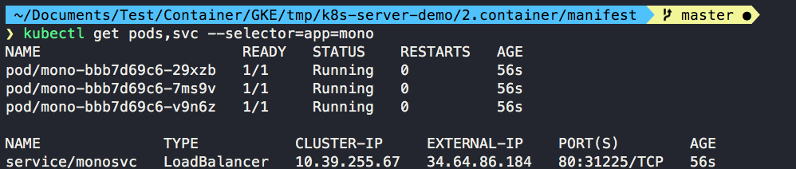
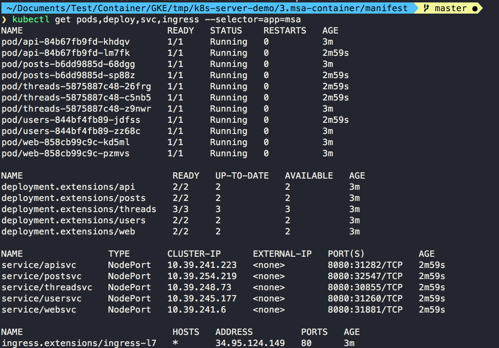

# Google Kubernetes Engine(GKE) Sample Test

***Base Code**: https://github.com/awslabs/amazon-ecs-nodejs-microservices*

**0. 가정사항**

* Google Cloud Platform(GCP)에 계정이 있음
* 기본적인 쿠버네티스 API Object를 이해함

  

**1.gke 기본 설정**

* 프로젝트 초기 설정

`gcloud init`

* Account 확인

`gcloud auth list`

* 프로젝트 확인

`gcloud config list project`

* basic parameter 설정

`my_project=my_projcet_paste`

`echo $my_project`

  

**2. Kubernetes Cluster**

* 아래와 같이 서울리전(asia-northeast3-a)에 sample-cluster로 클러스터를 생성하고 진행하였으나 없으면 console 혹은 gcloud를 활용하여 클러스터 생성

* gcloud로 basic cluster 생성 방법 (단일 리전 기본 클러스터)

`gcloud container clusters create sample-cluster --zone asia-northeast3-a`

* 클러스터 연결

`gcloud container clusters get-credentials sample-cluster --zone asia-northeast3-a --project $my_project`

  

**2. 동작확인**

설명: 1번 monolith directory에서 koa framework 동작

`node server.js`

아래와 같이 동작화면을 확인

  

**3. 단순 컨테이너화 확인**

설명: 2번 container directory의 경우 1번에서 작성한 코드를 그대로 컨테이너화하여 동작

* docker가 제대로 동작하는지 확인

`docker build -t mono:test .`

`docker run --name="demo-container" -p 8080:3000 mono:test`

(1번 동작화면과 동일한 화면이 보이면 됨)

* GKE에 구축하기 위해 GCR(Google Container Repository)에 Push

`source imagepush.sh`

* 내 환경(프로젝트 및 이미지 태그)에 맞게 변수 지정

`sed -i '' "s/my_project/$my_project/g" deploy.yaml`

`sed -i '' "s/TAG/$TAG/g" deploy.yaml`

(deploy.yaml 파일에 들어가서 내 프로젝트와 이미지가 제대로 변경되었는지 확인 필요)

* manifest directory로 이동하여 생성한 gke에 배포

`kubectl create -f deploy.yaml`

`kubectl create -f svc.yaml`

(정상적으로 진행이 된다면 tcp 로드밸런서에 의해 동작함)

* 생성 확인

* Load Balancer 주소 확인

`LB=$(kubectl get svc monosvc -o json | jq -r ".status.loadBalancer.ingress[].ip")`

`curl -i -L $LB`

  

**4. 마이크로 서비스 컨테이너화 확인**

설명: api 단위로 나누어서 배포 진행 (3번 directory로 들어가면 서비스별로 나눈 것을 확인할 수 있음)

* 이미지 생성 후 GCR에 Push

`source push.sh`

* 내 환경(프로젝트 및 이미지 태그)에 맞게 변수 지정

`source env.sh`

(deploy.yaml 파일에 들어가서 내 프로젝트와 이미지가 제대로 변경되었는지 확인 필요)

* manifest directory로 이동하여 생성한 gke에 배포

`kubectl create -f deploy.yaml`

`kubectl create -f svc.yaml`

`kubectl create -f ingress.yaml` 

* 생성 확인

`kubectl get all -L app:msa`

(정상적으로 진행이 된다면 HTTP 로드밸런서에 의해 동작함)

* Load Balancer 주소 확인

`LB=$(kubectl get ingress ingress-l7 -o json | jq -r ".status.loadBalancer.ingress[].ip")`

`echo $LB`

`curl -i -L $LB`

